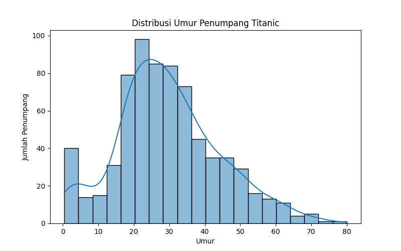

# Analisis Data Penumpang Titanic

Proyek ini bertujuan untuk melakukan eksplorasi data penumpang Titanic menggunakan Python.  
Analisis dilakukan dengan bantuan **pandas**, **seaborn**, dan **matplotlib** untuk memahami pola data dan menampilkan visualisasi.

---

## 📌 Tujuan
- Mengeksplorasi data penumpang Titanic.
- Membuat visualisasi distribusi umur, jumlah penumpang berdasarkan kelas, dan variabel penting lainnya.
- Memberikan insight sederhana dari dataset Titanic.

---

## Visualisasi

Distribusi umur penumpang Titanic:

